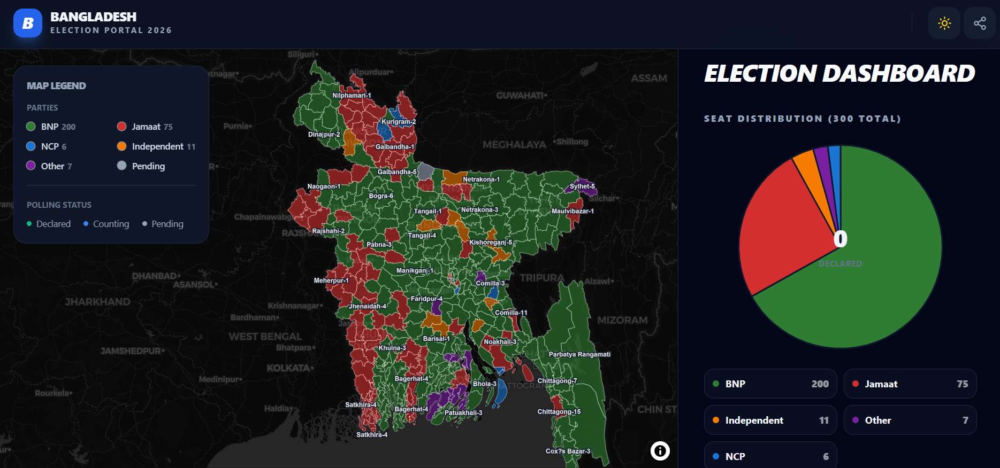

# 🗳️ Bangladesh Election Portal 2026

A premium, high-performance web application designed to provide real-time election results, interactive mapping, and data visualization for the 2026 Bangladesh General Elections.



## ✨ Core Features

### 📡 Live Result Synchronization
- **Live-First Engine**: Prioritizes real-time data from `geotasker.ai`.
- **Intelligent Fallback**: Seamlessly switches to local JSON snapshots if the live API is unreachable, ensuring zero downtime.
- **Visual Sync Status**: Real-time status badge (Live/Fallback/Syncing) with detailed diagnostic tooltips.

### 🗺️ Interactive Election Map
- **MapLibre Engine**: High-performance vector map rendering.
- **District Analytics**: Click any district to see specific winners, vote counts, and counting status.
- **Advanced Filtering**: Filter the entire ecosystem by political party or toggle "Contested/Swing" seats.
- **Dynamic Search**: Instantly fly to and highlight any district using the integrated search bar.

### 📊 Real-Time Analytics Dashboard
- **Chart.js Integration**: Beautifully animated Pie and Bar charts for seat distribution and performance analysis.
- **Live Result Ticker**: A professional, auto-scrolling news ticker showing the latest declared results as they arrive.
- **Status Progress**: Visual tracking of declaration progress (Total Seats vs. Declared).

### 🎨 Premium User Experience
- **Adaptive Dark Mode**: Fully refined Dark and Light themes with fluid transitions.
- **Snapshot Sharing**: Professional text-summary generator that copies the latest standings directly to your clipboard.
- **Mobile First**: Fully responsive design optimized for smartphones, tablets, and desktops.

---

## 🚀 Technical Stack

- **Frontend**: React 19 + Vite
- **Styling**: Tailwind CSS v3 (Premium Glassmorphism & Animations)
- **Mapping**: MapLibre GL + GeoJSON
- **Charts**: Chart.js + react-chartjs-2
- **Icons**: Lucide React
- **Data**: REST API + Local JSON Fallback

---

## 🛠️ Installation & Setup

1. **Clone & Install**
   ```bash
   npm install
   ```

2. **Development Mode**
   ```bash
   npm run dev
   ```

3. **Production Build**
   ```bash
   npm run build
   ```

---


**🌐 Powered by Geotasker AI Data Engine**
